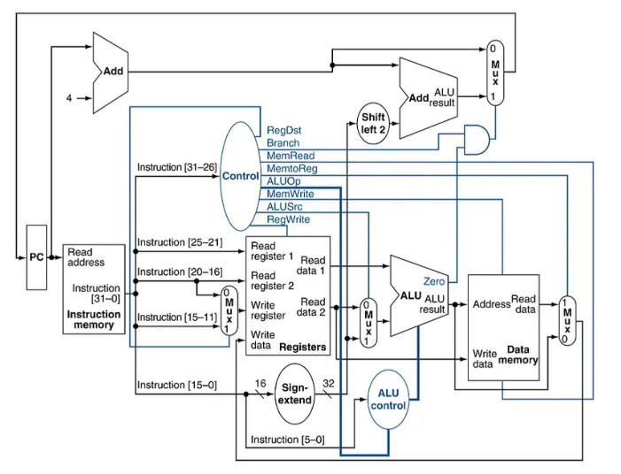
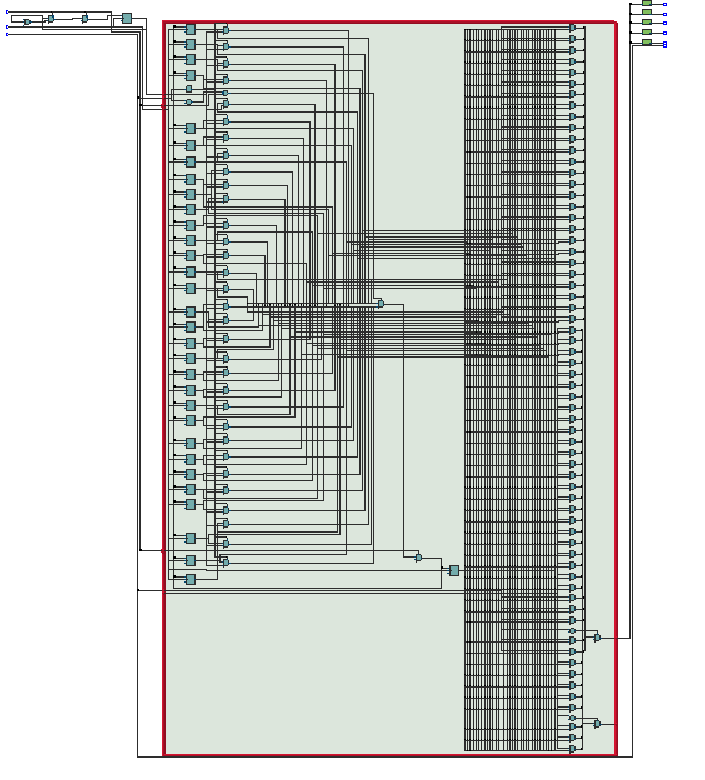
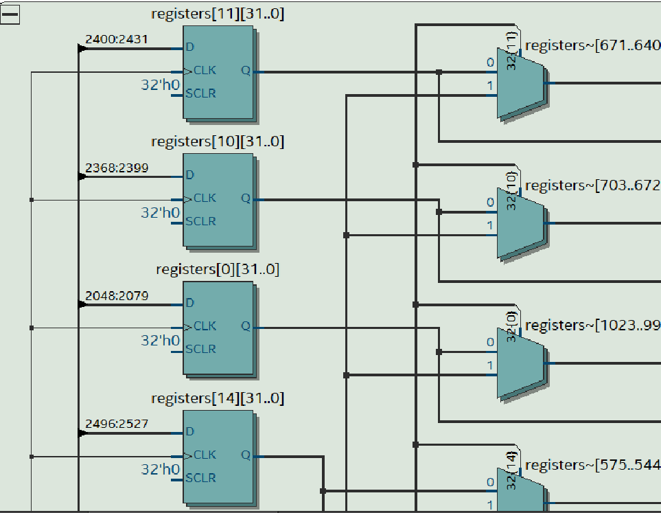
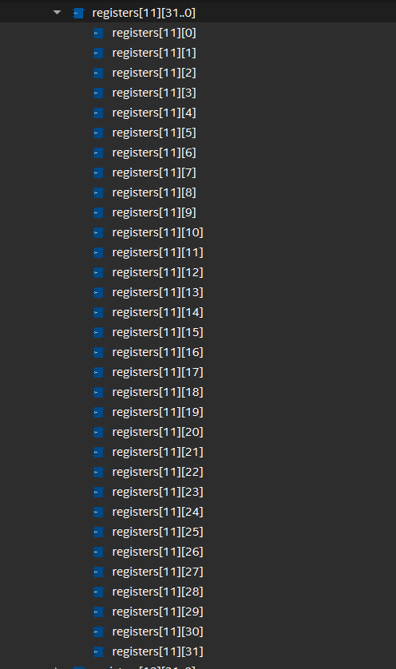
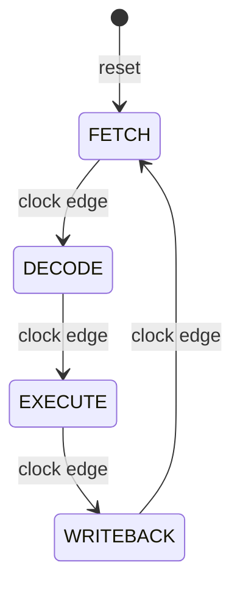

# RISC-V Machine  
---
## Overview
  

We're building a complete RISC-V processor by expanding our old VSM (Very Simple Machine). The VSM had 2 accumulators and a simple instruction set - now we're scaling up to 32 registers and the full RISC-V RV32I instruction set.

The core idea is the same: **4-stage FSM** (FETCH → DECODE → EXECUTE → WRITEBACK), but now we're handling way more instruction types and a 32-bit architecture.
## What We Built vs. What We Started With

### Old VSM:
- 2 accumulators
- 8-bit data
- 6 simple instructions
- 4-bit addresses
- Single accumulator operations

### New RISC-V Processor:
- 32 general-purpose registers
- 32-bit data
- 47+ instructions (full RV32I)
- 32-bit addresses
- Register-to-register operations
- Immediate operations
- Memory loads/stores
- Conditional branches
- Jumps and function calls

### What Stayed the Same:
- 4-stage FSM architecture (FETCH → DECODE → EXECUTE → WRITEBACK)
- Clock-driven sequential logic
- Control signals orchestrating datapath
- Same basic principles, just scaled up
---
## Why RISC-V? 
**vs. x86:**
- RISC-V is RISC (Reduced Instruction Set), x86 is CISC (Complex)
- Fixed 32-bit instruction size vs. variable length
- More registers (32 vs. 16)
- Load/store architecture (can't do ALU ops directly on memory)

**vs. ARM:**
- Very similar! Both are RISC
- RISC-V is open-source, ARM is proprietary
- RISC-V has simpler instruction encoding
- ARM has more complex conditional execution

**vs. MIPS:**
- RISC-V is heavily inspired by MIPS
- Similar register count and philosophy
- RISC-V has compressed instructions (C extension)
- Better immediate encoding in RISC-V

---
## ALU - The Math Engine
### ALU.v
The ALU (Arithmetic Logic Unit) does all the computational heavy lifting. Feed it two 32-bit numbers and tell it what operation to perform.

```verilog
module Arithmetic_Unit (
    input [31:0] A,
    input [31:0] B,
    input [3:0] ALU_Control,
    output reg [31:0] ALU_Result,
    output Zero
);
    localparam ADD  = 4'b0000;
    localparam SUB  = 4'b0001;
    localparam AND  = 4'b0010;
    localparam OR   = 4'b0011;
    localparam XOR  = 4'b0100;
    localparam SLT  = 4'b0101;  // Set less than (signed)
    localparam SLL  = 4'b0110;  // Shift left logical
    localparam SRL  = 4'b0111;  // Shift right logical
    localparam SRA  = 4'b1000;  // Shift right arithmetic
    localparam SLTU = 4'b1001;  // Set Less Than Unsigned
    
    always @(*) begin
        case(ALU_Control)
            ADD:  ALU_Result = A + B;
            SUB:  ALU_Result = A - B;
            AND:  ALU_Result = A & B;
            OR:   ALU_Result = A | B;
            XOR:  ALU_Result = A ^ B;
            SLT:  ALU_Result = ($signed(A) < $signed(B)) ? 32'd1 : 32'd0;
            SLL:  ALU_Result = A << B[4:0];
            SRL:  ALU_Result = A >> B[4:0];
            SRA:  ALU_Result = $signed(A) >>> B[4:0];
            SLTU: ALU_Result = (A < B) ? 32'd1 : 32'd0;
            default: ALU_Result = 32'd0;
        endcase
    end
    
    assign Zero = (ALU_Result == 32'd0);
endmodule
```

### ALU Operations Reference
|Binary|Operation|Explanation|
|---|---|---|
|0000|ADD|Adding two values|
|0001|SUB|Subtracting two values|
|0010|AND|Bitwise AND operation|
|0011|OR|Bitwise OR operation|
|0100|XOR|Exclusive OR operation|
|0101|SLT|Set less than (signed comparison)|
|0110|SLL|Shift logical left|
|0111|SRL|Shift logical right|
|1000|SRA|Shift right arithmetic (preserves sign)|
|1001|SLTU|Set less than unsigned|  

### Notes on Shifts
- **SLL/SRL**: Logical shifts fill with zeros
- **SRA**: Arithmetic shift preserves the sign bit (for signed division by powers of 2)
- Only use the lower 5 bits of B (max shift is 31 positions for 32-bit values)

### M Extension (Multiply/Divide) 
|Binary|Operation|Explanation|
|---|---|---|
|1010|MUL|Multiply two values (lower 32 bits)|
|1011|MULH|Multiply High (signed × signed, upper 32 bits)|
|1100|MULHSU|Multiply High Signed-Unsigned (signed × unsigned, upper 32 bits)|
|1101|MULHU|Multiply High Unsigned (unsigned × unsigned, upper 32 bits)|
|1110|DIV|Divide (signed)|
|1111|DIVU|Devide (unsigned)|  

At this point we have exhausted all 16 values for the ALU commands so we use a new system for the last 2 commands.  
|Binary|Operation|Explanation|
|---|---|---|
|0001_0000|REM|Remainder (unsigned)|
|0001_0001|REMU|Remainder (signed)|  

The M extension is deceptilvey a drain on hardware it is quite simple to write in verilog `result = A * B;` what is actually going on is:  
```
    AAAAAAAA (32 bits)
  × BBBBBBBB (32 bits)
  -----------
  RRRRRRRRRRRRRRRR (64 bits)
```

### ALU Test Driver
Quick test harness for the FPGA board:
```verilog
/* 
--------------------------------
ALU TEST
--------------------------------
*/
Arithmetic_Unit alu_test(
    .A (SW[9:6]),           // Variable values of A for testing operations
    .B (5'b00101),          // Loading a fixed value of 5 just cause
    .ALU_Control (SW[3:0]), 
    .ALU_Result (LEDR[6:0]), // Display binary value
    .Zero (LEDR[9])          // If any result is 0
);
```

---

## Registers - The Fast Memory
### RegisterFile.v
RISC-V has 32 general-purpose registers (x0-x31). x0 is special - it's hardwired to zero and ignores writes.

```verilog
module RegisterFile (
    input clk,
    input reset,
    input [4:0] rs1_addr,      // Read port 1 (5 bits = 32 regs)
    input [4:0] rs2_addr,      // Read port 2
    input [4:0] rd_addr,       // Write port
    input [31:0] rd_data,      // Data to write
    input reg_write,           // Write enable
    output [31:0] rs1_data,    // Read data 1
    output [31:0] rs2_data     // Read data 2
);

    // Storage for 32 registers
    reg [31:0] registers [0:31]; // A register of registers
    
    // Read ports: x0 always returns zero, others return stored value
    assign rs1_data = (rs1_addr == 5'd0) ? 32'd0 : registers[rs1_addr];
    assign rs2_data = (rs2_addr == 5'd0) ? 32'd0 : registers[rs2_addr];
    
    // Write port: block writes to x0
    always @(posedge clk) begin
        if (reset) begin
            integer i;
            for (i = 0; i < 32; i = i + 1)
                registers[i] <= 32'd0;
        end
        else if (reg_write && rd_addr != 5'd0)
            registers[rd_addr] <= rd_data;
    end
    
endmodule
```

### Register test driver
```verilog
//-------------------------------------
// Registers test
//-------------------------------------
wire clk = MAX10_CLK1_50;
wire reset = ~KEY[0];         // Press KEY[0] to reset
wire reg_write = ~KEY[1];     // Press KEY[1] to write

wire [4:0] rs1_addr = SW[4:0];      // Lower 5 switches = read address 1
wire [4:0] rs2_addr = 5'd1;         // Always read x1 on port 2
wire [4:0] rd_addr = SW[9:5];       // Upper 5 switches = write address

// Test data - increment on each write
reg [31:0] write_counter;

always @(posedge clk) begin
    if (reset)
        write_counter <= 32'd0;
    else if (reg_write)
        write_counter <= write_counter + 1;
end

wire [31:0] rs1_data;
wire [31:0] rs2_data;

RegisterFile regfile(
    .clk(clk),
    .reset(reset),
    .rs1_addr(rs1_addr),
    .rs2_addr(rs2_addr),
    .rd_addr(rd_addr),
    .rd_data(write_counter),
    .reg_write(reg_write),
    .rs1_data(rs1_data),
    .rs2_data(rs2_data)
);

// Display on LEDs
assign LEDR[9:5] = rd_addr;   // Show write address
assign LEDR[4:0] = rs1_addr;  // Show read address

// Display on 7-Segment (lower 24 bits of rs1_data)
seg7Decoder hex0(.i_bin(rs1_data[3:0]),   .o_HEX(HEX0));
seg7Decoder hex1(.i_bin(rs1_data[7:4]),   .o_HEX(HEX1));
seg7Decoder hex2(.i_bin(rs1_data[11:8]),  .o_HEX(HEX2));
seg7Decoder hex4(.i_bin(rs1_data[15:12]), .o_HEX(HEX4));
seg7Decoder hex5(.i_bin(rs1_data[19:16]), .o_HEX(HEX5));
```

### Further Explanations of RegisterFile  
  
Truly absurd   

The line of code in RegisterFile.v: 
`reg [31:0] registers [0:31];` creates 32 D flip-flops per register address, essentially a hash table of registers where each register address is the key and each sub-register are the buckets. This can be seen in the RTL Viewer built into Quartus.  

  
  

**Why x0 is special:** RISC-V spec says x0 must always read as zero. This gives you a "free" constant and a place to throw away results you don't need. It's hardwired in hardware - any write to x0 is ignored.

---

## Program Counter and Branch Unit
### ProgramCounter.v
The PC keeps track of which instruction we're executing. Most of the time it just increments by 4 (next instruction), but branches and jumps can change it.

```verilog
`default_nettype none

module ProgramCounter (
    input MainClock,
    input reset,
    input PCWrite,                  // Enable PC update
    input [1:0] PCSrc,              // Source select: 00=PC+4, 01=branch, 10=jump, 11=jalr
    input [31:0] branch_target,     // Branch target address
    input [31:0] jump_target,       // Jump target address (JAL)
    input [31:0] jalr_target,       // JALR target from ALU
    output reg [31:0] PC
);

    reg [31:0] next_pc;
    
    // Combinational logic for next PC calculation
    always @(*) begin
        case (PCSrc)
            2'b00:   next_pc = PC + 4;           // Normal: PC = PC + 4
            2'b01:   next_pc = branch_target;    // Branch taken
            2'b10:   next_pc = jump_target;      // JAL
            2'b11:   next_pc = jalr_target;      // JALR
            default: next_pc = PC + 4;
        endcase
    end
    
    // Sequential logic for PC register
    always @(posedge MainClock) begin
        if (reset)
            PC <= 32'b0;              // Reset to address 0
        else if (PCWrite)
            PC <= next_pc;            // Update PC when enabled
    end

endmodule

`default_nettype wire
```

**Why PC increments by 4:** Instructions are 32 bits = 4 bytes. Addresses point to bytes, so we skip ahead 4 bytes to get to the next instruction.

### BranchUnit.v
Calculates where branches and jumps should go. Branches and JAL are PC-relative (PC + offset), JALR is register-relative (rs1 + offset).

```verilog
`default_nettype none

module BranchUnit (
    input [31:0] PC,
    input [31:0] rs1_data,
    input [31:0] immediate,
    
    output [31:0] branch_target,  // Branch target: PC + imm
    output [31:0] jump_target,    // JAL target: PC + imm
    output [31:0] jalr_target     // JALR target: (rs1 + imm) & ~1
);

    // Branch and JAL: PC + immediate (PC-relative addressing)
    assign branch_target = PC + immediate;
    assign jump_target   = PC + immediate;
    
    // JALR: (rs1 + immediate) with LSB cleared for alignment
    assign jalr_target = (rs1_data + immediate) & 32'hFFFFFFFE;

endmodule

`default_nettype wire
```

**Why clear the LSB for JALR?** Instructions must be aligned to 4-byte boundaries. The LSB being 0 guarantees this. Trying to jump to an odd address would be a bug.

---

## Immediate Generator
### ImmediateGenerator.v
RISC-V instructions pack immediate values in different bit positions depending on type. This module extracts and reassembles them.

```verilog
`default_nettype none

module ImmediateGenerator (
    input [31:0] instruction,
    output reg [31:0] immediate
);

    wire [6:0] opcode;
    assign opcode = instruction[6:0];
    
    always @(*) begin
        case (opcode)
            // I-type: ADDI, SLTI, SLTIU, XORI, ORI, ANDI, SLLI, SRLI, SRAI
            // Also: Load instructions (LB, LH, LW, LBU, LHU) and JALR
            7'b0010011, 7'b0000011, 7'b1100111:
                begin
                    immediate = {{20{instruction[31]}}, instruction[31:20]};
                end
            
            // S-type: Store instructions (SB, SH, SW)
            7'b0100011:
                begin
                    immediate = {{20{instruction[31]}}, instruction[31:25], instruction[11:7]};
                end
            
            // B-type: Branch instructions (BEQ, BNE, BLT, BGE, BLTU, BGEU)
            7'b1100011:
                begin
                    immediate = {{19{instruction[31]}}, 
                                instruction[31], instruction[7],
                                instruction[30:25], instruction[11:8],
                                1'b0};
                end
            
            // U-type: LUI, AUIPC
            7'b0110111, 7'b0010111:
                begin
                    immediate = {instruction[31:12], 12'b0};
                end
            
            // J-type: JAL
            7'b1101111:
                begin
                    immediate = {{11{instruction[31]}},
                                instruction[31], instruction[19:12],
                                instruction[20], instruction[30:21],
                                1'b0};
                end
            
            default:
                begin
                    immediate = 32'b0;
                end
        endcase
    end

endmodule

`default_nettype wire
```

### Why Immediates Are Scrambled
RISC-V keeps register fields (rs1, rs2, rd) in the same bit positions across all instruction formats. This makes hardware decoding simpler. The immediate bits fill in the remaining space wherever they fit, which means they're scattered differently in each format. The ImmediateGenerator fixes this mess.

**Sign extension:** The `{{20{instruction[31]}}, ...}` syntax replicates bit 31 (the sign bit) 20 times. This turns a 12-bit signed number into a 32-bit signed number without changing its value.

---

## Control Unit - The Brain
### RISCV_Controller.v
This is where all the magic happens. The controller is a 4-stage FSM that orchestrates every other module. It looks at the current state and the instruction opcode, then sets control signals telling everyone what to do.

```verilog
`default_nettype none

module RISCV_Controller (
    input clk,
    input reset,
    input [6:0] opcode,
    input [2:0] funct3,
    input [6:0] funct7,
    input alu_zero,
    input alu_less_than,
    
    output reg RegWrite,
    output reg ALUSrc,
    output reg [3:0] ALUOp,
    output reg MemRead,
    output reg MemWrite,
    output reg MemToReg,
    output reg PCWrite,
    output reg IRWrite,
    output reg [1:0] PCSrc,
    output reg [1:0] state
);

    reg [1:0] next_state;
    
    localparam [1:0] FETCH     = 2'd0;
    localparam [1:0] DECODE    = 2'd1;
    localparam [1:0] EXECUTE   = 2'd2;
    localparam [1:0] WRITEBACK = 2'd3;
    
    localparam [6:0] OP_RTYPE  = 7'b0110011;
    localparam [6:0] OP_ITYPE  = 7'b0010011;
    localparam [6:0] OP_LOAD   = 7'b0000011;
    localparam [6:0] OP_STORE  = 7'b0100011;
    localparam [6:0] OP_BRANCH = 7'b1100011;
    localparam [6:0] OP_JAL    = 7'b1101111;
    localparam [6:0] OP_JALR   = 7'b1100111;
    localparam [6:0] OP_LUI    = 7'b0110111;
    localparam [6:0] OP_AUIPC  = 7'b0010111;
    
    localparam [3:0] ALU_ADD   = 4'b0000;
    localparam [3:0] ALU_SUB   = 4'b0001;
    localparam [3:0] ALU_AND   = 4'b0010;
    localparam [3:0] ALU_OR    = 4'b0011;
    localparam [3:0] ALU_XOR   = 4'b0100;
    localparam [3:0] ALU_SLT   = 4'b0101;
    localparam [3:0] ALU_SLL   = 4'b0110;
    localparam [3:0] ALU_SRL   = 4'b0111;
    localparam [3:0] ALU_SRA   = 4'b1000;
    localparam [3:0] ALU_SLTU  = 4'b1001;
    localparam [3:0] ALU_MUL   = 4'b1010;
    
    reg take_branch;
    
    // State register
    always @(posedge clk) begin
        if (reset)
            state <= FETCH;
        else
            state <= next_state;
    end
    
    // Next state logic
    always @(*) begin
        case (state)
            FETCH:      next_state = DECODE;
            DECODE:     next_state = EXECUTE;
            EXECUTE:    next_state = WRITEBACK;
            WRITEBACK:  next_state = FETCH;
            default:    next_state = FETCH;
        endcase
    end
    
    // Output logic
    always @(*) begin
        // Defaults
        RegWrite    = 1'b0;
        ALUSrc      = 1'b0;
        ALUOp       = ALU_ADD;
        MemRead     = 1'b0;
        MemWrite    = 1'b0;
        MemToReg    = 1'b0;
        PCWrite     = 1'b0;
        IRWrite     = 1'b0;
        PCSrc       = 2'b00;
        take_branch = 1'b0;
        
        case (state)
            FETCH:
                begin
                    IRWrite = 1'b1;
                    PCWrite = 1'b1;
                    PCSrc   = 2'b00;
                end
            
            DECODE:
                begin
                    // Register reads happen automatically
                end
            
            EXECUTE:
                begin
                    case (opcode)
                        OP_RTYPE:
                            begin
                                ALUSrc = 1'b0;
                                case (funct3)
                                    3'b000: ALUOp = (funct7[5]) ? ALU_SUB : ALU_ADD;
                                    3'b001: ALUOp = ALU_SLL;
                                    3'b010: ALUOp = ALU_SLT;
                                    3'b011: ALUOp = ALU_SLTU;
                                    3'b100: ALUOp = ALU_XOR;
                                    3'b101: ALUOp = (funct7[5]) ? ALU_SRA : ALU_SRL;
                                    3'b110: ALUOp = ALU_OR;
                                    3'b111: ALUOp = ALU_AND;
                                    default: ALUOp = ALU_ADD;
                                endcase
                            end
                        
                        OP_ITYPE:
                            begin
                                ALUSrc = 1'b1;
                                case (funct3)
                                    3'b000: ALUOp = ALU_ADD;
                                    3'b010: ALUOp = ALU_SLT;
                                    3'b011: ALUOp = ALU_SLTU;
                                    3'b100: ALUOp = ALU_XOR;
                                    3'b110: ALUOp = ALU_OR;
                                    3'b111: ALUOp = ALU_AND;
                                    3'b001: ALUOp = ALU_SLL;
                                    3'b101: ALUOp = (funct7[5]) ? ALU_SRA : ALU_SRL;
                                    default: ALUOp = ALU_ADD;
                                endcase
                            end
                        
                        OP_LOAD:
                            begin
                                ALUSrc   = 1'b1;
                                ALUOp    = ALU_ADD;
                                MemRead  = 1'b1;
                                MemToReg = 1'b1;
                            end
                        
                        OP_STORE:
                            begin
                                ALUSrc   = 1'b1;
                                ALUOp    = ALU_ADD;
                                MemWrite = 1'b1;
                            end
                        
                        OP_BRANCH:
                            begin
                                ALUSrc = 1'b0;
                                ALUOp  = ALU_SUB;
                                case (funct3)
                                    3'b000: take_branch = alu_zero;
                                    3'b001: take_branch = ~alu_zero;
                                    3'b100: take_branch = alu_less_than;
                                    3'b101: take_branch = ~alu_less_than;
                                    3'b110: take_branch = alu_less_than;
                                    3'b111: take_branch = ~alu_less_than;
                                    default: take_branch = 1'b0;
                                endcase
                                if (take_branch) begin
                                    PCWrite = 1'b1;
                                    PCSrc   = 2'b01;
                                end
                            end
                        
                        OP_JAL:
                            begin
                                PCWrite = 1'b1;
                                PCSrc   = 2'b10;
                            end
                        
                        OP_JALR:
                            begin
                                ALUSrc  = 1'b1;
                                ALUOp   = ALU_ADD;
                                PCWrite = 1'b1;
                                PCSrc   = 2'b11;
                            end
                        
                        default: begin end
                    endcase
                end
            
            WRITEBACK:
                begin
                    case (opcode)
                        OP_RTYPE, OP_ITYPE:
                            begin
                                RegWrite = 1'b1;
                                MemToReg = 1'b0;
                            end
                        OP_LOAD:
                            begin
                                RegWrite = 1'b1;
                                MemToReg = 1'b1;
                            end
                        OP_JAL, OP_JALR:
                            begin
                                RegWrite = 1'b1;
                            end
                        OP_LUI, OP_AUIPC:
                            begin
                                RegWrite = 1'b1;
                            end
                        default: begin end
                    endcase
                end
        endcase
    end

endmodule

`default_nettype wire
```

### FSM State Diagram


### What Each State Does

**FETCH:** Grab the next instruction from memory
- Load instruction register
- Prepare to update PC (default: PC+4)

**DECODE:** Break the instruction apart
- Extract opcode, rs1, rs2, rd, funct3, funct7
- Read registers (happens automatically)
- Generate immediate

**EXECUTE:** Do the actual work
- R-type/I-type: ALU operation
- Load: Calculate address, read memory
- Store: Calculate address, write memory
- Branch: Compare and decide whether to jump
- Jump: Calculate target

**WRITEBACK:** Save the result
- R/I-type: Write ALU result to register
- Load: Write memory data to register
- JAL/JALR: Write return address (PC+4) to register
- Store/Branch: Don't write anything

### Control Signals Explained

**RegWrite:** Should we write to the register file? (1 = yes, 0 = no)

**ALUSrc:** Where does the ALU's second input come from? (0 = rs2, 1 = immediate)

**ALUOp:** Which ALU operation? (matches ALU opcodes)

**MemRead/MemWrite:** Are we accessing memory?

**MemToReg:** What gets written to register? (0 = ALU result, 1 = memory data)

**PCSrc:** Where does next PC come from? (00=PC+4, 01=branch, 10=JAL, 11=JALR)

---

## RISC-V Instruction Formats

Every RISC-V instruction is 32 bits, organized into 6 different formats:

### R-Type (Register-Register)
**Used for:** ADD, SUB, AND, OR, XOR, SLL, SRL, SRA, SLT, SLTU

```
 31      25 24  20 19  15 14  12 11   7 6     0
┌─────────┬──────┬──────┬──────┬──────┬───────┐
│ funct7  │ rs2  │ rs1  │funct3│  rd  │opcode │
└─────────┴──────┴──────┴──────┴──────┴───────┘
```

### I-Type (Immediate Operations)
**Used for:** ADDI, ORI, ANDI, LW, LH, LB, JALR

```
 31              20 19  15 14  12 11   7 6     0
┌──────────────────┬──────┬──────┬──────┬───────┐
│   immediate      │ rs1  │funct3│  rd  │opcode │
└──────────────────┴──────┴──────┴──────┴───────┘
```

### S-Type (Store)
**Used for:** SW, SH, SB

```
 31      25 24  20 19  15 14  12 11   7 6     0
┌─────────┬──────┬──────┬──────┬──────┬───────┐
│imm[11:5]│ rs2  │ rs1  │funct3│imm[4:0]opcode │
└─────────┴──────┴──────┴──────┴──────┴───────┘
```

### B-Type (Branch)
**Used for:** BEQ, BNE, BLT, BGE, BLTU, BGEU

```
 31 30   25 24  20 19  15 14  12 11  8 7 6     0
┌──┬──────┬──────┬──────┬──────┬─────┬─┬───────┐
│12│[10:5]│ rs2  │ rs1  │funct3│[4:1]│11 opcode│
└──┴──────┴──────┴──────┴──────┴─────┴─┴───────┘
```

### U-Type (Upper Immediate)
**Used for:** LUI, AUIPC

```
 31                      12 11   7 6     0
┌─────────────────────────┬──────┬───────┐
│   immediate[31:12]      │  rd  │opcode │
└─────────────────────────┴──────┴───────┘
```

### J-Type (Jump)
**Used for:** JAL

```
 31 30    21 20 19      12 11   7 6     0
┌──┬────────┬──┬──────────┬──────┬───────┐
│20│ [10:1] │11│ [19:12]  │  rd  │opcode │
└──┴────────┴──┴──────────┴──────┴───────┘
```

### Quick Reference Tables

**Opcodes**
| Opcode | Format | Instruction Type |
|--------|--------|------------------|
| 0110011 | R-type | ADD, SUB, AND, OR, XOR, shifts |
| 0010011 | I-type | ADDI, ANDI, ORI, XORI, shifts |
| 0000011 | I-type | LW, LH, LB, LBU, LHU |
| 0100011 | S-type | SW, SH, SB |
| 1100011 | B-type | BEQ, BNE, BLT, BGE, BLTU, BGEU |
| 1101111 | J-type | JAL |
| 1100111 | I-type | JALR |
| 0110111 | U-type | LUI |
| 0010111 | U-type | AUIPC |

**Funct3 for R/I Arithmetic**
| funct3 | R-type | I-type |
|--------|--------|--------|
| 000 | ADD/SUB* | ADDI |
| 001 | SLL | SLLI |
| 010 | SLT | SLTI |
| 011 | SLTU | SLTIU |
| 100 | XOR | XORI |
| 101 | SRL/SRA* | SRLI/SRAI* |
| 110 | OR | ORI |
| 111 | AND | ANDI |

*Check funct7[5]: 0=ADD/SRL, 1=SUB/SRA

**Funct3 for Branches**
| funct3 | Condition |
|--------|-----------|
| 000 | BEQ (equal) |
| 001 | BNE (not equal) |
| 100 | BLT (less than signed) |
| 101 | BGE (greater/equal signed) |
| 110 | BLTU (less than unsigned) |
| 111 | BGEU (greater/equal unsigned) |

**Funct3 for Load/Store**
| funct3 | Load | Store | Size |
|--------|------|-------|------|
| 000 | LB | SB | Byte (8-bit) |
| 001 | LH | SH | Halfword (16-bit) |
| 010 | LW | SW | Word (32-bit) |
| 100 | LBU | - | Byte unsigned |
| 101 | LHU | - | Halfword unsigned |

### Decoding Example

**Hex:** `0x002081B3`

**Binary:** `0000000 00010 00001 000 00011 0110011`

**Breakdown:**
- Opcode [6:0] = `0110011` → R-type
- rd [11:7] = `00011` → x3
- funct3 [14:12] = `000` → ADD/SUB
- rs1 [19:15] = `00001` → x1
- rs2 [24:20] = `00010` → x2
- funct7 [31:25] = `0000000` → ADD (not SUB)

**Result:** `ADD x3, x1, x2` (x3 = x1 + x2)

## Data Memory - RAM
### DataMemory.v
The data memory is where loads and stores actually happen. It's byte-addressable RAM that supports different access sizes.

```verilog
`default_nettype none

module DataMemory (
    input clk,
    input reset,
    input [31:0] addr,              // Byte address
    input [31:0] write_data,        // Data to write
    input mem_read,                 // Read enable
    input mem_write,                // Write enable
    input [2:0] funct3,             // Determines size/signedness
    output reg [31:0] read_data
);

    // Memory array: 1024 words = 4KB of RAM
    reg [31:0] memory [0:1023];
    
    // Word address and byte offset
    wire [9:0] word_addr = addr[11:2];
    wire [1:0] byte_offset = addr[1:0];
    
    // Temp storage
    reg [31:0] word_data;
    reg [15:0] halfword_data;
    reg [7:0] byte_data;
    
    // Initialize to zero
    integer i;
    initial begin
        for (i = 0; i < 1024; i = i + 1)
            memory[i] = 32'h00000000;
    end
    
    // Write operations (Store instructions)
    always @(posedge clk) begin
        if (mem_write && !reset) begin
            case (funct3)
                // SW - Store Word
                3'b010: memory[word_addr] <= write_data;
                
                // SH - Store Halfword
                3'b001: begin
                    case (byte_offset[1])
                        1'b0: memory[word_addr][15:0]  <= write_data[15:0];
                        1'b1: memory[word_addr][31:16] <= write_data[15:0];
                    endcase
                end
                
                // SB - Store Byte
                3'b000: begin
                    case (byte_offset)
                        2'b00: memory[word_addr][7:0]   <= write_data[7:0];
                        2'b01: memory[word_addr][15:8]  <= write_data[7:0];
                        2'b10: memory[word_addr][23:16] <= write_data[7:0];
                        2'b11: memory[word_addr][31:24] <= write_data[7:0];
                    endcase
                end
            endcase
        end
    end
    
    // Read operations (Load instructions)
    always @(*) begin
        read_data = 32'h00000000;
        
        if (mem_read) begin
            word_data = memory[word_addr];
            
            case (funct3)
                // LW - Load Word
                3'b010: read_data = word_data;
                
                // LH - Load Halfword (signed)
                3'b001: begin
                    halfword_data = byte_offset[1] ? word_data[31:16] : word_data[15:0];
                    read_data = {{16{halfword_data[15]}}, halfword_data};
                end
                
                // LHU - Load Halfword Unsigned
                3'b101: begin
                    halfword_data = byte_offset[1] ? word_data[31:16] : word_data[15:0];
                    read_data = {16'h0000, halfword_data};
                end
                
                // LB - Load Byte (signed)
                3'b000: begin
                    case (byte_offset)
                        2'b00: byte_data = word_data[7:0];
                        2'b01: byte_data = word_data[15:8];
                        2'b10: byte_data = word_data[23:16];
                        2'b11: byte_data = word_data[31:24];
                    endcase
                    read_data = {{24{byte_data[7]}}, byte_data};
                end
                
                // LBU - Load Byte Unsigned
                3'b100: begin
                    case (byte_offset)
                        2'b00: byte_data = word_data[7:0];
                        2'b01: byte_data = word_data[15:8];
                        2'b10: byte_data = word_data[23:16];
                        2'b11: byte_data = word_data[31:24];
                    endcase
                    read_data = {24'h000000, byte_data};
                end
            endcase
        end
    end

endmodule

`default_nettype wire
```

### How Memory Addressing Works

**Byte-Addressable Memory:**
RISC-V uses byte addresses, but we store data as 32-bit words. This means:

```
Address:    0    1    2    3    4    5    6    7    8    ...
           [---- Word 0 ----][---- Word 1 ----][---- Word 2 ----]
           [Byte0-1-2-3][Byte0-1-2-3][Byte0-1-2-3]
```

For address `0x0000000C` (decimal 12):
- Bits [11:2] = word address = 3 → which 32-bit word
- Bits [1:0] = byte offset = 0 → which byte within that word

**Example:** Memory word 2 contains `0x12345678`
- Address 8 (byte 0): `0x78`
- Address 9 (byte 1): `0x56`
- Address 10 (byte 2): `0x34`
- Address 11 (byte 3): `0x12`

### Sign Extension vs Zero Extension

This is crucial for understanding signed vs unsigned loads:

**Signed loads (LB, LH):**
```
Load byte 0xFF:
  LB  → 0xFFFFFFFF (sign-extended, treats as -1)
  LBU → 0x000000FF (zero-extended, treats as 255)
```

**Why it matters:**
- Signed: preserves the value of negative numbers
- Unsigned: treats all values as positive

**Example:**
```
Memory[0] = 0x000000FF

LB from address 0:
  → Byte is 0xFF
  → Sign bit (bit 7) is 1
  → Sign-extend: 0xFFFFFFFF = -1 (signed interpretation)

LBU from address 0:
  → Byte is 0xFF
  → Zero-extend: 0x000000FF = 255 (unsigned interpretation)
```

### Partial Writes

Store instructions only modify the bytes they target:

```
Initial:  Memory[2] = 0x12345678

SB to address 8 (word 2, byte 0), data = 0xAB:
  → Memory[2] = 0x123456AB (only byte 0 changed)

SH to address 8 (word 2, bytes 0-1), data = 0xCDEF:
  → Memory[2] = 0x1234CDEF (only bytes 0-1 changed)

SW to address 8 (word 2), data = 0xAABBCCDD:
  → Memory[2] = 0xAABBCCDD (entire word replaced)
```

### Load/Store Operations Summary

| Instruction | Size | Extension | Funct3 |
|-------------|------|-----------|--------|
| LB | 8-bit | Sign | 000 |
| LH | 16-bit | Sign | 001 |
| LW | 32-bit | None | 010 |
| LBU | 8-bit | Zero | 100 |
| LHU | 16-bit | Zero | 101 |
| SB | 8-bit | N/A | 000 |
| SH | 16-bit | N/A | 001 |
| SW | 32-bit | N/A | 010 |

### Testing the Data Memory

```verilog
// Use switches to select operation and address
// KEY[0] = reset, KEY[1] = execute
// SW[9:7] = operation (000=SW, 001=SH, 010=SB, 011=LW, 100=LH, 101=LB)
// SW[6:0] = address
// Display shows read data on 7-segment displays
```

**Test sequence:**
1. Write word `0x12345678` to address 0
2. Read it back → should see `12345678` on display
3. Write byte `0xAB` to address 1
4. Read word from address 0 → should see `1234AB78`
5. Read byte from address 1 → should see `000000AB`

This proves partial writes work correctly!

---

## Module Progress Tracker

✅ **Completed:**
- ALU (all base operations + SLTU, ready for MUL)
- Register File (32 x 32-bit registers with x0 hardwired to zero)
- Program Counter (with branch/jump support)
- Branch Unit (target calculation for branches, JAL, JALR)
- Immediate Generator (all 6 instruction formats)
- Control Unit FSM (complete RV32I support)
- Data Memory (4KB RAM with byte/halfword/word access)

□ **To Do:**
- Instruction Memory (ROM for program storage)
- Top-level integration module
- Full system testing

---

---
## Architecture Overview

Here's how all the pieces fit together:

```
┌─────────────────┐
│ Instruction     │
│ Memory (ROM)    │
└────────┬────────┘
         │
         ↓ (32-bit instruction)
┌─────────────────┐
│ Instruction     │──→ opcode, rs1, rs2, rd, funct3, funct7
│ Decoder         │
└─────────────────┘
         │
         ↓
┌─────────────────┐     ┌──────────────┐
│ Control Unit    │────→│ Control      │
│ (FSM)           │     │ Signals      │
└─────────────────┘     └──────────────┘
         │                      │
         ↓                      ↓
┌─────────────────┐     ┌──────────────┐
│ Immediate       │     │ Register     │
│ Generator       │     │ File         │
└────────┬────────┘     └──────┬───────┘
         │                     │
         └──────────┬──────────┘
                    ↓
            ┌───────────────┐
            │ ALU           │
            └───────┬───────┘
                    │
         ┌──────────┴──────────┐
         ↓                     ↓
┌─────────────────┐    ┌──────────────┐
│ Data Memory     │    │ Program      │
│ (RAM)           │    │ Counter      │
└─────────────────┘    └──────────────┘
```

**Data Flow:**
1. PC points to current instruction
2. Instruction Memory returns 32-bit instruction
3. Decoder breaks it into fields
4. Control Unit sets control signals based on opcode
5. Register File reads rs1 and rs2
6. Immediate Generator extracts immediate value
7. ALU performs operation
8. Result goes to Register File or Data Memory
9. PC updates (PC+4, branch target, or jump target)

---


## Testing Strategy

### Phase 1: Component Testing
Test each module individually:
- ALU: All operations with known inputs
- Register File: Read/write with x0 protection
- PC: Incrementing and branching
- Immediate Generator: All instruction formats

### Phase 2: Instruction Type Testing
Test by instruction category:
1. **R-type:** `ADD x3, x1, x2`
2. **I-type:** `ADDI x1, x0, 5`
3. **Loads:** `LW x2, 0(x1)` (once memory is added)
4. **Stores:** `SW x2, 4(x1)` (once memory is added)
5. **Branches:** `BEQ x1, x2, label`
6. **Jumps:** `JAL x1, function`

### Phase 3: Real Programs
Write actual programs:
- **Counter:** Increment a register in a loop
- **Fibonacci:** Calculate sequence
- **Bubble sort:** Sort an array
- **Function calls:** JAL/JALR with return addresses
One day
---

## Lessons Learned

**What worked well:**
- Breaking the project into modules
- Testing each module independently
- Using the same FSM structure as VSM
- Leveraging AI for syntax help (**not design help**)

**What was challenging:**
- Immediate encoding is genuinely weird
- Branch target calculation has subtle details
- Control signal timing is critical
- x0 hardwiring requires constant vigilance

**What I'd do differently:**
- Build testbenches earlier
- Document control signals as I went
- Draw more diagrams
- Give myself a longer time window to work on this
- Give myself a smaller scope
---

## Resources

**RISC-V Specs:**
- Official RISC-V ISA Manual: https://riscv.org/technical/specifications/
- RISC-V Card (quick reference): https://github.com/jameslzhu/riscv-card

**Learning Resources:**
- "Computer Organization and Design RISC-V Edition" by Patterson & Hennessy
- "Digital Design and Computer Architecture RISC-V Edition" by Harris & Harris

**Tools:**
- RISC-V Instruction Encoder/Decoder: https://luplab.gitlab.io/rvcodecjs/
- Venus RISC-V Simulator: https://venus.cs61c.org/

## Final Notes

I bit off more than I could chew. Trying to build a RISC-V processor in just over a week was hard. But that said, this was undoubtedly the most fun project in my academic career. I chose to do this over something easier to bridge my knowledge gap between my Comp Sci classes and my Engineering classes. It's been cool to see how the perverbial sausage is made. Is this the end? **NO**. I have to turn my board in eventually but that said I'll keep theory crafting this project. Maybe check back in and see how it's going.  

---
## Special Thanks
**To Dr. Goncalo Martins and Dr. Daniel Stevenson**
