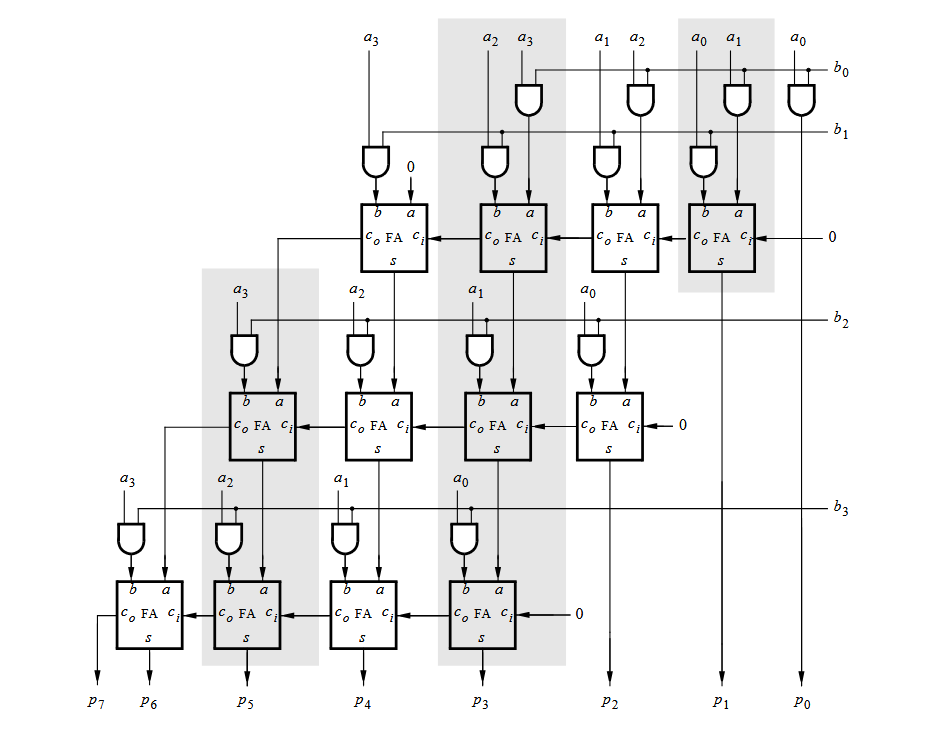

#### ENCE 3100 Lab 5
Colin McBride
  
## Part 1:  
## Part 2: 
## Part 3:

## Part 4: 

What went wrong. 
pt 1: In correct output types 

pt 2: Incorrect output types again

pt 3: my wire naming scheme was so bad I actually got lost trying to build it all leading to errors with certian number values. I tried using GPT to help but it made everything so much worse by insiting on doing it it's own way 

pt 4: 
