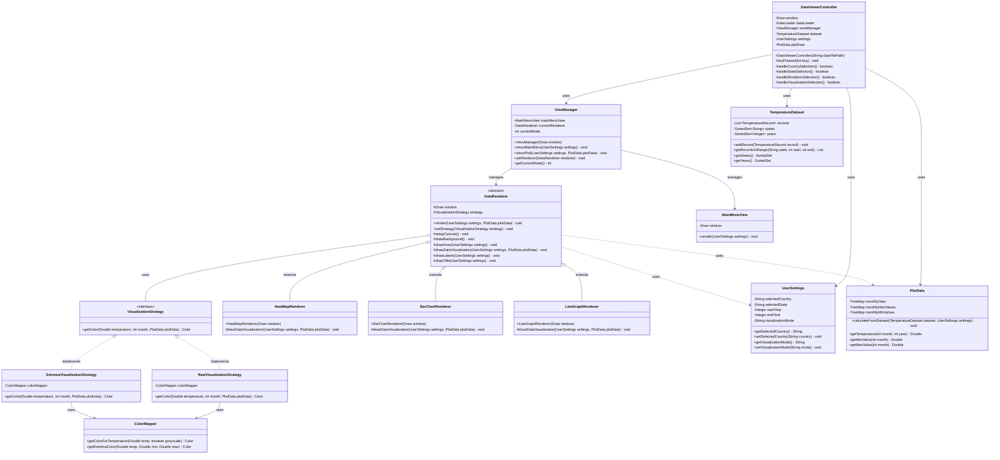

ENCE 3100 with Professor Goncalo Fernandes Pereira Martins

```mermaid
classDiagram
    %% STRATEGY PATTERN - Visualization Strategies
    class VisualizationStrategy {
        <<interface>>
        +getColor(Double temperature, int month, PlotData plotData) Color
    }
    
    class RawVisualizationStrategy {
        -ColorMapper colorMapper
        +getColor(Double temperature, int month, PlotData plotData) Color
    }
    
    class ExtremaVisualizationStrategy {
        -ColorMapper colorMapper
        +getColor(Double temperature, int month, PlotData plotData) Color
    }
    
    %% TEMPLATE METHOD PATTERN - Renderers
    class DataRenderer {
        <<abstract>>
        #Draw window
        #VisualizationStrategy strategy
        +render(UserSettings settings, PlotData plotData) void
        +setStrategy(VisualizationStrategy strategy) void
        #setupCanvas() void
        #drawBackground() void
        #drawAxes(UserSettings settings) void
        #drawDataVisualization(UserSettings settings, PlotData plotData)* void
        #drawLabels(UserSettings settings) void
        #drawTitle(UserSettings settings) void
    }
    
    class HeatMapRenderer {
        +HeatMapRenderer(Draw window)
        #drawDataVisualization(UserSettings settings, PlotData plotData) void
    }
    
    class BarChartRenderer {
        +BarChartRenderer(Draw window)
        #drawDataVisualization(UserSettings settings, PlotData plotData) void
    }
    
    class LineGraphRenderer {
        +LineGraphRenderer(Draw window)
        #drawDataVisualization(UserSettings settings, PlotData plotData) void
    }
    
    %% Existing Classes from Milestone 1
    class DataViewerController {
        -Draw window
        -DataLoader dataLoader
        -ViewManager viewManager
        -TemperatureDataset dataset
        -UserSettings settings
        -PlotData plotData
        +DataViewerController(String dataFilePath)
        +keyPressed(int key) void
        -handleCountrySelection() boolean
        -handleStateSelection() boolean
        -handleRendererSelection() boolean
        -handleVisualizationSelection() boolean
    }
    
    class ViewManager {
        -MainMenuView mainMenuView
        -DataRenderer currentRenderer
        -int currentMode
        +ViewManager(Draw window)
        +showMainMenu(UserSettings settings) void
        +showPlot(UserSettings settings, PlotData plotData) void
        +setRenderer(DataRenderer renderer) void
        +getCurrentMode() int
    }
    
    class UserSettings {
        -String selectedCountry
        -String selectedState
        -Integer startYear
        -Integer endYear
        -String visualizationMode
        +getSelectedCountry() String
        +setSelectedCountry(String country) void
        +getVisualizationMode() String
        +setVisualizationMode(String mode) void
    }
    
    class PlotData {
        -TreeMap monthlyData
        -TreeMap monthlyMaxValues
        -TreeMap monthlyMinValues
        +calculateFromDataset(TemperatureDataset dataset, UserSettings settings) void
        +getTemperature(int month, int year) Double
        +getMinValue(int month) Double
        +getMaxValue(int month) Double
    }
    
    class TemperatureDataset {
        -List~TemperatureRecord~ records
        -SortedSet~String~ states
        -SortedSet~Integer~ years
        +addRecord(TemperatureRecord record) void
        +getRecordsInRange(String state, int start, int end) List
        +getStates() SortedSet
        +getYears() SortedSet
    }
    
    class ColorMapper {
        +getColorForTemperature(Double temp, boolean grayscale) Color
        +getExtremaColor(Double temp, Double min, Double max) Color
    }
    
    class MainMenuView {
        -Draw window
        +render(UserSettings settings) void
    }
    
    %% STRATEGY PATTERN RELATIONSHIPS
    VisualizationStrategy <|.. RawVisualizationStrategy : implements
    VisualizationStrategy <|.. ExtremaVisualizationStrategy : implements
    
    %% TEMPLATE METHOD PATTERN RELATIONSHIPS
    DataRenderer <|-- HeatMapRenderer : extends
    DataRenderer <|-- BarChartRenderer : extends
    DataRenderer <|-- LineGraphRenderer : extends
    DataRenderer o-- VisualizationStrategy : uses
    
    %% CONTROLLER RELATIONSHIPS
    DataViewerController --> ViewManager : uses
    DataViewerController --> UserSettings : uses
    DataViewerController --> TemperatureDataset : uses
    DataViewerController --> PlotData : uses
    
    %% VIEW MANAGER RELATIONSHIPS
    ViewManager --> MainMenuView : manages
    ViewManager --> DataRenderer : manages
    
    %% STRATEGY USES COLOR MAPPER
    RawVisualizationStrategy --> ColorMapper : uses
    ExtremaVisualizationStrategy --> ColorMapper : uses
    
    %% RENDERER USES PLOT DATA
    DataRenderer ..> PlotData : uses
    DataRenderer ..> UserSettings : uses

```
