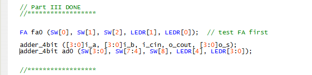

how do I bold text  
# Lab 2 Report 
**Written by Colin McBride**  

Logism Diagram for Part 1:  

Main.v of Part 1:  
  

7 Segment Decoder code:  
  

- **Purpose:**  
  Converts a 4-bit binary input into the 7-segment display pattern needed to light up digits `0–9`.
- **Inputs:**  
  - `i_m3, i_m2, i_m1, i_m0` → 4-bit binary input (most significant bit first).

- **Outputs:**  
  - `o_seg[7:0]` → The signals that control each LED segment (a–g, and sometimes DP).

- **Operation:**  
  Implements Boolean equations that map binary numbers `0000–1001` (decimal 0–9) into the correct LED on/off pattern.  
  For values `1010–1111` (decimal 10–15), the decoder treats them as **don’t-cares**, since only decimal digits are shown.
  
-----------------------------------------------------------------------------------
#Part 2
# Lab Report – Binary-to-Decimal Conversion (Part II)

## Design Overview

### 1. Binary-to-Decimal Conversion
- Input: 4-bit binary number `V`.
- Output: Two decimal digits `D = d1d0`.
- Example conversion:
  - Binary `0101` → Decimal `05`
  - Binary `1111` → Decimal `15`
- Table of conversions (from lab manual):

| Binary | Decimal |
|--------|---------|
| 0000   | 0 0     |
| 0001   | 0 1     |
| 0010   | 0 2     |
| ...    | ...     |
| 1001   | 0 9     |
| 1010   | 1 0     |
| 1011   | 1 1     |
| 1100   | 1 2     |
| 1101   | 1 3     |
| 1110   | 1 4     |
| 1111   | 1 5     |

### 2. Circuit Components
- **Comparator:** Detects when `V > 9` to control the tens digit output.
- **Multiplexers:** Select proper output digits based on comparator.
- **Circuit A:** Implements combinational logic to generate decimal digits from binary input.
- **Boolean Logic Implementation:** All logic functions are implemented using `assign` statements; no `if-else` or `case` statements are used.

---

## Implementation Details
- Verilog module includes:
  - 4-bit input `V`
  - 4-bit output `M` (intermediate BCD)
  - Output `z` (control signal from comparator)
- Simulation was performed to verify the correct operation of the comparator, multiplexers, and Circuit A.
- Later augmentation included Circuit B and a 7-segment decoder to display outputs:
  - Switches `SW3−0` represent binary input `V`.
  - 7-segment displays `HEX1` and `HEX0` show decimal digits `d1` and `d0`.
- Pin assignments were made for the DE2 board to connect switches and 7-segment displays.

## Images:   

**Main of Part 2:**  

  
  
  
  

---

-----------------------------------------------------------------------------------
#Part 3  
## Design Overview

### Full Adder Logic
- **Inputs:**
  - `i_a` – first operand bit
  - `i_b` – second operand bit
  - `i_cin` – carry-in bit
- **Outputs:**
  - `o_s` – sum bit
  - `o_cout` – carry-out bit
 
  ##Image of adder implementation:  
  **PT 3 Main:**  
  
  **Full Adder:**  
  
### Implementation Details
- Verilog module `FA` uses **combinational logic only**, implemented with `assign` statements.
- No `always` blocks or sequential logic are used.
- The module uses `default_nettype none` to enforce explicit wire declarations for safety and clarity.
-----------------------------------------------------------------------------------
#Part 4
## Design Overview

### 1. Binary-Coded Decimal (BCD) Representation
- Each decimal digit is represented using 4 bits.
- Example: decimal 59 → BCD 0101 1001.
- The largest sum possible in this circuit is `9 + 9 + 1 = 19`.

### 2. Single-Digit BCD Adder
- Previous parts: 
  - Uses Circuit B and the Comparator from part 2
  - Uses a 4-bit adder (from Part III) to produce a 4-bit sum and a carry-out for `A + B + cin`.
  - A binary-to-BCD converter is applied to the 5-bit result to produce two BCD digits (`S1S0`) similar to the conversion circuit from Part II.
- **Verilog Implementation:**
  - The logic is implemented using simple `assign` statements.
  - Required a revamping of circuit A from part 2 to account for the new maximum number being 18

### 3. Input/Output Mapping
- **Inputs via switches:**
  - `SW[3:0]` = BCD digit `B`
  - `SW[7:4]` = BCD digit `A`
  - `SW[8]` = carry-in `cin`
- **Outputs:**
  - Red LEDs (`LEDR`) reflect the input switch values.
  - Green LEDs (`LEDG`) display the 4-bit sum and carry-out.
  - 7-segment displays:
    - `HEX6` → BCD digit `A`
    - `HEX4` → BCD digit `B`
    - `HEX1` and `HEX0` → BCD sum `S1S0`

-----------------------------------------------------------------------------------
#Part 5

## Design Overview

### 1. Single-Digit BCD Adder (Part IV Module)
- **`adder_4bit`**: Adds two 4-bit BCD numbers, outputs a 4-bit sum and a carry-out.
- **`bin_to_dec_v2`**: Converts a 4-bit BCD sum (plus carry) to 7-segment display signals.
- **`checkBCD`**: Verifies valid BCD inputs and signals errors via LEDs.

### 2. Two-Digit BCD Adder (Top-Level Design)
- Two instances of the single-digit adder are instantiated hierarchically:
  - **Least Significant Digit (A0 + B0):** First adder takes lower 4 bits of `A` and `B` from switches, with carry-in = 0. Produces `sum0` and `carry0`.
  - **Most Significant Digit (A1 + B1):** Second adder takes upper 4 bits of `A` and a fixed `B1 = 4'b1111` (board limitation). Adds `carry0` to produce `sum1` and `carry1`.
- Three-digit sum `S2S1S0`:
  - `S0` = least significant sum (`sum0`)
  - `S1` = most significant sum (`sum1`)
  - `S2` = carry-out from second adder (`carry1`) representing hundreds digit
 
  
-----------------------------------------------------------------------------------
**Sources**
I used Chat GPT for the formatting of this readme  
I think it did a good job
