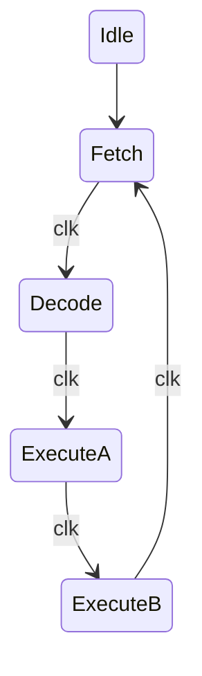

# Lab 8: Micro Processors  


Part 1: explanation of the uP  
contains the all the stuff from Martins lecture.  
 

Part 2: building the thing  
### Code for the ALU:
```verilog
`default_nettype none

module Arithmetic_Unit #
(
	parameter N = 4
)
(
	input EnableALU,
	input AddSub,
	input [N-1:0] A,
	input [N-1:0] B,
	output reg Carry,
	output reg [N-1:0] IB_ALU
);

always @(*) begin
	// if AddSub 1, sub,
	// A - B store send it out to the bus
	reg [N-1:0] ALUout = (AddSub == 1'b1) ? B - A : B + A;
	// TODO fix the trunkated carry out bit

	// we feed into the bus so we need high impedence
	assign IB_ALU = (EnableALU == 1'b1) ? ALUout : {N{1'bZ}};

end
endmodule
```  
A line of code used in the ALU is:
```verilog
assign IB_BUS = (EnableA == 1'b1) ? AluA : {N{1'bZ}}; //
```
This crucial for preventing bus contention. When EnableA is low, the output goes to high impedance (Z state), which basically disconnects accumulator A from the bus. This lets other modules talk on the bus without everything trying to output at once and causing a short circuit. Without this, you'd have multiple outputs fighting each other on the same wire.  
### Logisim of the ALU:  
  
### Code for Accumulator A:
```verilog
`default_nettype none

module Accumulator_A #
(
	parameter N = 4
)
(
	input MainClock,
	input ClearA,
	input LatchA,
	input EnableA,
	input [N-1:0] A,
	output [N-1:0] IB_BUS,
	output reg [N-1:0] AluA
);

	// Sequential Logic
	always @(posedge MainClock) begin
		if (ClearA)
			AluA <= {N{1'b0}};
		else begin
			if(LatchA)
				AluA <= A; //Load A into the ALU
		end
		
	
	end
	// Combinational Logic
	// this will be the high impedence
	assign IB_BUS = (EnableA == 1'b1) ? AluA : {N{1'bZ}}; //

endmodule

`default_nettype wire
```  
### Code for Accumulator B:
```verilog 
`default_nettype none

module Accumulator_B #
(
	parameter N = 4
)
(
	input MainClock,
	input ClearB,
	input LatchB,
	input [N-1:0] B,
	output reg [N-1:0] AluB
);

	// Sequential Logic
	always @(posedge MainClock) begin
		if (ClearB)
			AluB <= {N{1'b0}};
		else begin
			if(LatchB)
				AluB <= B; //Load B into the ALU
		end
		
endmodule

`default_nettype wire
```  

### ROM and Controller:
```verilog

`default_nettype none

module ROM_Nx8 #
(
	parameter N = 8
)
(
	input [$clog2(N)-1:0] address,
	output reg [7:0] data
);

	(* ramstyle = "logic" *) reg [7:0] rom [0:N-1];

	// Initialize memeory
	// Maximum 16 instructions
	initial begin
		rom[0] =8'h55; // Load 5 into accumulator A
		rom[0] =8'h12; // Add 2
		rom[0] =8'h30; // Output the value stored in accumulator A
		rom[0] =8'h28; // Subtract 8
		rom[0] =8'h30; // Output
		rom[0] =8'h40; // Take in a value
		rom[0] =8'h13; // Add 3
		rom[0] =8'h30; // Output
	end
	
	// Async combinational logic
	always @(*) begin
		data = rom[address];
	end

endmodule

`default_nettype wire
```  
Values for commands are stored in 8 bits inside the ROM. Given the artifical constraint of the BUS being only 4 bits a system is needed to break down the 8 bits outputed by the program memory. We can break the 8 bit into two 4 bit with the first being instruction and the secon being data. The 6 operations this VSM uses are in the table below.
**ROM Table**
|Binary|Operation||
|---|---|---|
|0000|NOP|No Operation|
|0001|ADD|Adds the values of A and B|
|0010|SUB||Subtracts the values of A and B|
|0011|OUT|Out puts the value of A|
|0100|IN|Takes a given input of a User|
|0101|LDA|Loads a value into Accumulator A|  

The Control unit needs to be destructed further into two pieces a Micro Instruction module and an Instruction Register. Doing so will mandate the creation a finite state machine to cycle throough stages of Fetch (stage 1), Decode (stage 2), Execute A (stage 3), Execute B (stage 4). Cycling through each stage per clock cycle, see the diagram below.  

The FSM cycles through four phases every instruction. Phase 1 fetches the instruction from ROM and loads it into the instruction register. Phase 2 increments the program counter to point at the next instruction. Phase 3 and 4 are where the actual work happens - they activate different control signals depending on what instruction we're executing. Some instructions only need Phase 3, others use both phases.  
```verilog
`default_nettype none

module FSM_MicroInstr #
(
	parameter N = 4
)
(
	input clk,
	input reset,
	input [N-1:0] IB_BUS,
	
	output reg LatchA,
	output reg EnableA,
	output reg LatchB,
	output reg EnableALU,
	output reg AddSub,
	output reg EnableIN,
	output reg EnableOut,
	output reg LoadInstr,
	output reg EnableInstr,
	input [N-1:0]	ToInstr,
	output reg EnableCount
);

	reg [2:0] state, next_state;

	// States
	localparam [2:0] IDLE = 3'd0, PHASE_1 = 3'd1, PHASE_2 = 3'd2, PHASE_3 = 3'd3, PHASE_4 = 3'd4;

	// 1. State Register (sequential)
	always @(posedge clk) begin
		if(reset)
			state <= IDLE;
		else
			state <= next_state;
	end
	
	// 2. Next-State Logic (combinational)
	always @(*) begin
		
		next_state = state; // default: hold state
	
		case(state)
		
			IDLE: 
				begin		
					// Move to FETCH
					next_state = PHASE_1;
				end
			
			// FETCH Instruction
			PHASE_1:
				begin
					// Move to DECODE
					next_state = PHASE_2;
				end
			
			// DECODE Instruction	
			PHASE_2:
				begin
					// Move to EXECUTE A
					next_state = PHASE_3;
				end
				
			// EXECUTE A Instruction
			PHASE_3:
				begin
					// Move to EXECUTE B
					next_state = PHASE_4;
				end
			
			// EXECUTE B Instruction	
			PHASE_4:
				begin
					// Move to FETCH
					next_state = PHASE_1;
				end
				
			default: ;// None
		
		endcase
	end
	
	// 3. Output Logic (combinational)
```
The code above serves the purpose of our finite state machine. The code below is part of the above module and our controller.
```verilog
	always @(*) begin
	
		// default all signals are zero
		LoadInstr 	= 1'b0;
		EnableInstr = 1'b0;
		LatchB 		= 1'b0;
		LatchA 		= 1'b0;
		EnableALU 	= 1'b0;
		EnableCount = 1'b0;
		AddSub		= 1'b0;
		EnableIN		= 1'b0;
		EnableA		= 1'b0;
		EnableOut	= 1'b0;
	
		case(state)
		
			IDLE: 
				begin
					// Initialize things if needed
				end
			
			// FETCH Instruction
			PHASE_1:
				begin
					LoadInstr 	= 1'b1;
				end
			
			// DECODE Instruction	
			PHASE_2:
				begin
					EnableCount = 1'b1;
					EnableInstr = 1'b0;
				end
				
			// EXECUTE Instruction
			PHASE_3:
				begin
					case (ToInstr)
						4'b0000: //NOP
							begin
							end
						4'b0001: //ADD
							begin
								LatchB = 1'b1;
								EnableInstr = 1'b1;
							end
						4'b0010: //SUB
							begin
								LatchB = 1'b1;
								EnableInstr = 1'b1;
							end
						4'b0011: //OUT
							begin
								LatchA = 1'b1;
								EnableOut = 1'b1;
							end
						4'b0100: //IN
							begin
								LatchA = 1'b1;
								EnableIN = 1'b1;
							end
						4'b0101: //LDA
							begin
								LatchA = 1'b1;
								EnableInstr = 1'b1;
							end
							
					endcase
				end
			
			// EXECUTE Instruction	
			PHASE_4:
				begin
					case (ToInstr)
						4'b0000: //NOP
							begin
							end
						4'b0001: //ADD
							begin
								LatchA = 1'b1;
								EnableALU = 1'b1;
							end
						4'b0010: //SUB
							begin
								LatchA = 1'b1;
								EnableALU = 1'b1;
								AddSub = 1'b1;
							end
						4'b0011: //OUT
							begin
							end
						4'b0100: //IN
							begin
							end
						4'b0101: //LDA
							begin
							end
							
					endcase
				end
		
		endcase
	end

endmodule

`default_nettype wire
```
| NOPI_0000 | Phase 1<br>0001 | Phase 2<br>0010 | Phase 3<br>0100 | Phase 4<br>1000 |
|-----------|-----------------|-----------------|-----------------|-----------------|
| ProgCount | 0 | 1 | 0 | 0 |
| EnableOut | 0 | 0 | 0 | 0 |
| LoadInstr | 1 | 0 | 0 | 0 |
| LatchB | 0 | 0 | 0 | 0 |
| LatchA | 0 | 0 | 0 | 0 |
| EnableInstr | 0 | 1 | 0 | 0 |
| EnableIn | 0 | 0 | 0 | 0 |
| EnableAlu | 0 | 0 | 0 | 0 |
| EnableA | 0 | 0 | 0 | 0 |
| AddSub | 0 | 0 | 0 | 0 |

| ADDI_0001 | Phase 1<br>0001 | Phase 2<br>0010 | Phase 3<br>0100 | Phase 4<br>1000 |
|-----------|-----------------|-----------------|-----------------|-----------------|
| ProgCount | 0 | 1 | 0 | 0 |
| EnableOut | 0 | 0 | 0 | 0 |
| LoadInstr | 1 | 0 | 0 | 0 |
| LatchB | 0 | 0 | 0 | 0 |
| LatchA | 0 | 0 | 0 | 1 |
| EnableInstr | 0 | 1 | 1 | 0 |
| EnableIn | 0 | 0 | 0 | 0 |
| EnableAlu | 0 | 0 | 0 | 1 |
| EnableA | 0 | 0 | 0 | 0 |
| AddSub | 0 | 0 | 0 | 0 |

| SUBI_0010 | Phase 1<br>0001 | Phase 2<br>0010 | Phase 3<br>0100 | Phase 4<br>1000 |
|-----------|-----------------|-----------------|-----------------|-----------------|
| ProgCount | 0 | 1 | 0 | 0 |
| EnableOut | 0 | 0 | 0 | 0 |
| LoadInstr | 1 | 0 | 0 | 0 |
| LatchB | 0 | 0 | 1 | 0 |
| LatchA | 0 | 0 | 0 | 1 |
| EnableInstr | 0 | 1 | 1 | 0 |
| EnableIn | 0 | 0 | 0 | 0 |
| EnableAlu | 0 | 0 | 0 | 1 |
| EnableA | 0 | 0 | 0 | 0 |
| AddSub | 0 | 0 | 0 | 1 |

| OUTI_0011 | Phase 1<br>0001 | Phase 2<br>0010 | Phase 3<br>0100 | Phase 4<br>1000 |
|----------|-----------------|-----------------|-----------------|-----------------|
| ProgCount | 0 | 1 | 0 | 0 |
| EnableOut | 0 | 0 | 1 | 0 |
| LoadInstr | 1 | 0 | 0 | 0 |
| LatchB | 0 | 0 | 0 | 0 |
| LatchA | 0 | 0 | 0 | 0 |
| EnableInstr | 0 | 1 | 0 | 0 |
| EnableIn | 0 | 0 | 0 | 0 |
| EnableAlu | 0 | 0 | 0 | 0 |
| EnableA | 0 | 0 | 0 | 0 |
| AddSub | 0 | 0 | 0 | 0 |

| INI_0100 | Phase 1<br>0001 | Phase 2<br>0010 | Phase 3<br>0100 | Phase 4<br>1000 |
|----------|-----------------|-----------------|-----------------|-----------------|
| ProgCount | 0 | 1 | 0 | 0 |
| EnableOut | 0 | 0 | 0 | 0 |
| LoadInstr | 1 | 0 | 0 | 0 |
| LatchB | 0 | 0 | 0 | 0 |
| LatchA | 0 | 0 | 1 | 0 |
| EnableInstr | 0 | 1 | 0 | 0 |
| EnableIn | 0 | 0 | 1 | 0 |
| EnableAlu | 0 | 0 | 0 | 0 |
| EnableA | 0 | 0 | 0 | 0 |
| AddSub | 0 | 0 | 0 | 0 |

| LDA_0101 | Phase 1<br>0001 | Phase 2<br>0010 | Phase 3<br>0100 | Phase 4<br>1000 |
|----------|-----------------|-----------------|-----------------|-----------------|
| ProgCount | 0 | 1 | 0 | 0 |
| EnableOut | 0 | 0 | 0 | 0 |
| LoadInstr | 1 | 0 | 0 | 0 |
| LatchB | 0 | 0 | 0 | 0 |
| LatchA | 0 | 0 | 1 | 0 |
| EnableInstr | 0 | 1 | 1 | 0 |
| EnableIn | 0 | 0 | 0 | 0 |
| EnableAlu | 0 | 0 | 0 | 0 |
| EnableA | 0 | 0 | 1 | 0 |
| AddSub | 0 | 0 | 0 | 0 |
