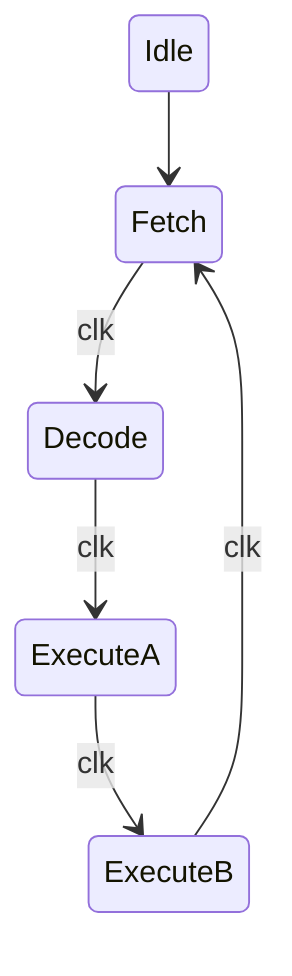

# Lab 8: Micro Processors  


### Processor Architecture Overview
  
This microprocessor follows a simple Von Neumann architecture with a 4-bit internal bus connecting all the major components. The bus is the highway that data travels on between modules - only one module can transmit at a time, which is why everything uses high impedance states when they're not actively talking.
The processor has five main functional blocks connected to the bus. Accumulator A holds one operand and can output its value back to the bus. Accumulator B holds the other operand but is write-only from the bus perspective. The Arithmetic Unit does the actual addition and subtraction between A and B. The Input and Output registers handle communication with the outside world - Input lets us read external data onto the bus, Output displays whatever's on the bus externally.
The control logic sits on the left side. Program memory is an 8×8 ROM that stores our instructions. The Program Counter keeps track of which instruction we're on and increments each cycle. The Instruction Register holds the current instruction being executed. And the Micro Instruction unit (our FSM) orchestrates everything by generating all the enable and latch signals that tell each component when to read from or write to the bus.
The whole system is clocked, so everything happens in sync. Each instruction takes four clock cycles to complete - fetch, decode, execute A, execute B. The Micro Instruction block sequences through these phases and activates the right control signals at the right time to make each instruction happen.  
 
### Code for the ALU:
```verilog
`default_nettype none

module Arithmetic_Unit #
(
	parameter N = 4
)
(
	input EnableALU,
	input AddSub,
	input [N-1:0] A,
	input [N-1:0] B,
	output reg Carry,
	output reg [N-1:0] IB_ALU
);

always @(*) begin
	// if AddSub 1, sub,
	// A - B store send it out to the bus
	reg [N-1:0] ALUout = (AddSub == 1'b1) ? B - A : B + A;
	// TODO fix the trunkated carry out bit

	// we feed into the bus so we need high impedence
	assign IB_ALU = (EnableALU == 1'b1) ? ALUout : {N{1'bZ}};

end
endmodule
```  
A line of code used in the ALU is:
```verilog
assign IB_BUS = (EnableA == 1'b1) ? AluA : {N{1'bZ}}; //
```
This crucial for preventing bus contention. When EnableA is low, the output goes to high impedance (Z state), which basically disconnects accumulator A from the bus. This lets other modules talk on the bus without everything trying to output at once and causing a short circuit. Without this, you'd have multiple outputs fighting each other on the same wire.  
### Logisim of the ALU:  
  
### Code for Accumulator A:
```verilog
`default_nettype none

module Accumulator_A #
(
	parameter N = 4
)
(
	input MainClock,
	input ClearA,
	input LatchA,
	input EnableA,
	input [N-1:0] A,
	output [N-1:0] IB_BUS,
	output reg [N-1:0] AluA
);

	// Sequential Logic
	always @(posedge MainClock) begin
		if (ClearA)
			AluA <= {N{1'b0}};
		else begin
			if(LatchA)
				AluA <= A; //Load A into the ALU
		end
		
	
	end
	// Combinational Logic
	// this will be the high impedence
	assign IB_BUS = (EnableA == 1'b1) ? AluA : {N{1'bZ}}; //

endmodule

`default_nettype wire
```  
### Code for Accumulator B:
```verilog 
`default_nettype none

module Accumulator_B #
(
	parameter N = 4
)
(
	input MainClock,
	input ClearB,
	input LatchB,
	input [N-1:0] B,
	output reg [N-1:0] AluB
);

	// Sequential Logic
	always @(posedge MainClock) begin
		if (ClearB)
			AluB <= {N{1'b0}};
		else begin
			if(LatchB)
				AluB <= B; //Load B into the ALU
		end
		
endmodule

`default_nettype wire
```  
### Program Counter
```verilog
`default_nettype none

module ProgramCounter #
(
	parameter N = 4
)
(
	input MainClock,
	input EnableCount,
	input ClearCounter,
	output reg [N-1:0] Counter
);

	always @(posedge MainClock) begin
		if(ClearCounter)
			Counter <= {N{1'b0}};
		else if(EnableCount)
			Counter <= Counter + 1;
	end
	
endmodule

`default_nettype wire
```  
The Program Counter keeps track of which instruction we're currently executing. It's basically just a counter that increments by one each time EnableCount goes high. The FSM activates EnableCount during Phase 2 (the decode phase) so the counter advances to the next instruction while the current one is being executed.   
### ROM and Controller:
```verilog

`default_nettype none

module ROM_Nx8 #
(
	parameter N = 8
)
(
	input [$clog2(N)-1:0] address,
	output reg [7:0] data
);

	(* ramstyle = "logic" *) reg [7:0] rom [0:N-1];

	// Initialize memeory
	// Maximum 16 instructions
	initial begin
		rom[0] =8'h55; // Load 5 into accumulator A
		rom[0] =8'h12; // Add 2
		rom[0] =8'h30; // Output the value stored in accumulator A
		rom[0] =8'h28; // Subtract 8
		rom[0] =8'h30; // Output
		rom[0] =8'h40; // Take in a value
		rom[0] =8'h13; // Add 3
		rom[0] =8'h30; // Output
	end
	
	// Async combinational logic
	always @(*) begin
		data = rom[address];
	end

endmodule

`default_nettype wire
```  
Values for commands are stored in 8 bits inside the ROM. Given the artifical constraint of the BUS being only 4 bits a system is needed to break down the 8 bits outputed by the program memory. We can break the 8 bit into two 4 bit with the first being instruction and the secon being data. The 6 operations this VSM uses are in the table below.


**ROM Table**
|Binary|Operation||
|---|---|---|
|0000|NOP|No Operation|
|0001|ADD|Adds the values of A and B|
|0010|SUB||Subtracts the values of A and B|
|0011|OUT|Out puts the value of A|
|0100|IN|Takes a given input of a User|
|0101|LDA|Loads a value into Accumulator A|  

The Control unit needs to be destructed further into two pieces a Micro Instruction module and an Instruction Register. Doing so will mandate the creation a finite state machine to cycle throough stages of Fetch (stage 1), Decode (stage 2), Execute A (stage 3), Execute B (stage 4). Cycling through each stage per clock cycle, see the diagram below.  

The FSM cycles through four phases every instruction. Phase 1 fetches the instruction from ROM and loads it into the instruction register. Phase 2 increments the program counter to point at the next instruction. Phase 3 and 4 are where the actual work happens - they activate different control signals depending on what instruction we're executing. Some instructions only need Phase 3, others use both phases.  
```verilog
`default_nettype none

module FSM_MicroInstr #
(
	parameter N = 4
)
(
	input clk,
	input reset,
	input [N-1:0] IB_BUS,
	
	output reg LatchA,
	output reg EnableA,
	output reg LatchB,
	output reg EnableALU,
	output reg AddSub,
	output reg EnableIN,
	output reg EnableOut,
	output reg LoadInstr,
	output reg EnableInstr,
	input [N-1:0]	ToInstr,
	output reg EnableCount
);

	reg [2:0] state, next_state;

	// States
	localparam [2:0] IDLE = 3'd0, PHASE_1 = 3'd1, PHASE_2 = 3'd2, PHASE_3 = 3'd3, PHASE_4 = 3'd4;

	// 1. State Register (sequential)
	always @(posedge clk) begin
		if(reset)
			state <= IDLE;
		else
			state <= next_state;
	end
	
	// 2. Next-State Logic (combinational)
	always @(*) begin
		
		next_state = state; // default: hold state
	
		case(state)
		
			IDLE: 
				begin		
					// Move to FETCH
					next_state = PHASE_1;
				end
			
			// FETCH Instruction
			PHASE_1:
				begin
					// Move to DECODE
					next_state = PHASE_2;
				end
			
			// DECODE Instruction	
			PHASE_2:
				begin
					// Move to EXECUTE A
					next_state = PHASE_3;
				end
				
			// EXECUTE A Instruction
			PHASE_3:
				begin
					// Move to EXECUTE B
					next_state = PHASE_4;
				end
			
			// EXECUTE B Instruction	
			PHASE_4:
				begin
					// Move to FETCH
					next_state = PHASE_1;
				end
				
			default: ;// None
		
		endcase
	end
	
	// 3. Output Logic (combinational)
```
The code above serves the purpose of our finite state machine. The code below is part of the above module and our controller.
```verilog
	always @(*) begin
	
		// default all signals are zero
		LoadInstr 	= 1'b0;
		EnableInstr = 1'b0;
		LatchB 		= 1'b0;
		LatchA 		= 1'b0;
		EnableALU 	= 1'b0;
		EnableCount = 1'b0;
		AddSub		= 1'b0;
		EnableIN		= 1'b0;
		EnableA		= 1'b0;
		EnableOut	= 1'b0;
	
		case(state)
		
			IDLE: 
				begin
					// Initialize things if needed
				end
			
			// FETCH Instruction
			PHASE_1:
				begin
					LoadInstr 	= 1'b1;
				end
			
			// DECODE Instruction	
			PHASE_2:
				begin
					EnableCount = 1'b1;
					EnableInstr = 1'b0;
				end
				
			// EXECUTE Instruction
			PHASE_3:
				begin
					case (ToInstr)
						4'b0000: //NOP
							begin
							end
						4'b0001: //ADD
							begin
								LatchB = 1'b1;
								EnableInstr = 1'b1;
							end
						4'b0010: //SUB
							begin
								LatchB = 1'b1;
								EnableInstr = 1'b1;
							end
						4'b0011: //OUT
							begin
								LatchA = 1'b1;
								EnableOut = 1'b1;
							end
						4'b0100: //IN
							begin
								LatchA = 1'b1;
								EnableIN = 1'b1;
							end
						4'b0101: //LDA
							begin
								LatchA = 1'b1;
								EnableInstr = 1'b1;
							end
							
					endcase
				end
			
			// EXECUTE Instruction	
			PHASE_4:
				begin
					case (ToInstr)
						4'b0000: //NOP
							begin
							end
						4'b0001: //ADD
							begin
								LatchA = 1'b1;
								EnableALU = 1'b1;
							end
						4'b0010: //SUB
							begin
								LatchA = 1'b1;
								EnableALU = 1'b1;
								AddSub = 1'b1;
							end
						4'b0011: //OUT
							begin
							end
						4'b0100: //IN
							begin
							end
						4'b0101: //LDA
							begin
							end
							
					endcase
				end
		
		endcase
	end

endmodule

`default_nettype wire
```
| NOPI_0000 | Phase 1<br>0001 | Phase 2<br>0010 | Phase 3<br>0100 | Phase 4<br>1000 |
|-----------|-----------------|-----------------|-----------------|-----------------|
| ProgCount | 0 | 1 | 0 | 0 |
| EnableOut | 0 | 0 | 0 | 0 |
| LoadInstr | 1 | 0 | 0 | 0 |
| LatchB | 0 | 0 | 0 | 0 |
| LatchA | 0 | 0 | 0 | 0 |
| EnableInstr | 0 | 1 | 0 | 0 |
| EnableIn | 0 | 0 | 0 | 0 |
| EnableAlu | 0 | 0 | 0 | 0 |
| EnableA | 0 | 0 | 0 | 0 |
| AddSub | 0 | 0 | 0 | 0 |

| ADDI_0001 | Phase 1<br>0001 | Phase 2<br>0010 | Phase 3<br>0100 | Phase 4<br>1000 |
|-----------|-----------------|-----------------|-----------------|-----------------|
| ProgCount | 0 | 1 | 0 | 0 |
| EnableOut | 0 | 0 | 0 | 0 |
| LoadInstr | 1 | 0 | 0 | 0 |
| LatchB | 0 | 0 | 0 | 0 |
| LatchA | 0 | 0 | 0 | 1 |
| EnableInstr | 0 | 1 | 1 | 0 |
| EnableIn | 0 | 0 | 0 | 0 |
| EnableAlu | 0 | 0 | 0 | 1 |
| EnableA | 0 | 0 | 0 | 0 |
| AddSub | 0 | 0 | 0 | 0 |

| SUBI_0010 | Phase 1<br>0001 | Phase 2<br>0010 | Phase 3<br>0100 | Phase 4<br>1000 |
|-----------|-----------------|-----------------|-----------------|-----------------|
| ProgCount | 0 | 1 | 0 | 0 |
| EnableOut | 0 | 0 | 0 | 0 |
| LoadInstr | 1 | 0 | 0 | 0 |
| LatchB | 0 | 0 | 1 | 0 |
| LatchA | 0 | 0 | 0 | 1 |
| EnableInstr | 0 | 1 | 1 | 0 |
| EnableIn | 0 | 0 | 0 | 0 |
| EnableAlu | 0 | 0 | 0 | 1 |
| EnableA | 0 | 0 | 0 | 0 |
| AddSub | 0 | 0 | 0 | 1 |

| OUTI_0011 | Phase 1<br>0001 | Phase 2<br>0010 | Phase 3<br>0100 | Phase 4<br>1000 |
|----------|-----------------|-----------------|-----------------|-----------------|
| ProgCount | 0 | 1 | 0 | 0 |
| EnableOut | 0 | 0 | 1 | 0 |
| LoadInstr | 1 | 0 | 0 | 0 |
| LatchB | 0 | 0 | 0 | 0 |
| LatchA | 0 | 0 | 0 | 0 |
| EnableInstr | 0 | 1 | 0 | 0 |
| EnableIn | 0 | 0 | 0 | 0 |
| EnableAlu | 0 | 0 | 0 | 0 |
| EnableA | 0 | 0 | 0 | 0 |
| AddSub | 0 | 0 | 0 | 0 |

| INI_0100 | Phase 1<br>0001 | Phase 2<br>0010 | Phase 3<br>0100 | Phase 4<br>1000 |
|----------|-----------------|-----------------|-----------------|-----------------|
| ProgCount | 0 | 1 | 0 | 0 |
| EnableOut | 0 | 0 | 0 | 0 |
| LoadInstr | 1 | 0 | 0 | 0 |
| LatchB | 0 | 0 | 0 | 0 |
| LatchA | 0 | 0 | 1 | 0 |
| EnableInstr | 0 | 1 | 0 | 0 |
| EnableIn | 0 | 0 | 1 | 0 |
| EnableAlu | 0 | 0 | 0 | 0 |
| EnableA | 0 | 0 | 0 | 0 |
| AddSub | 0 | 0 | 0 | 0 |

| LDA_0101 | Phase 1<br>0001 | Phase 2<br>0010 | Phase 3<br>0100 | Phase 4<br>1000 |
|----------|-----------------|-----------------|-----------------|-----------------|
| ProgCount | 0 | 1 | 0 | 0 |
| EnableOut | 0 | 0 | 0 | 0 |
| LoadInstr | 1 | 0 | 0 | 0 |
| LatchB | 0 | 0 | 0 | 0 |
| LatchA | 0 | 0 | 1 | 0 |
| EnableInstr | 0 | 1 | 1 | 0 |
| EnableIn | 0 | 0 | 0 | 0 |
| EnableAlu | 0 | 0 | 0 | 0 |
| EnableA | 0 | 0 | 1 | 0 |
| AddSub | 0 | 0 | 0 | 0 |  

### A unite
```verilog

`default_nettype none

module main(
	input		MAX10_CLK1_50,
	input		[1:0]		KEY,
	input		[9:0]		SW,
	inout		[35:0] 	GPIO,
	output	[9:0]		LEDR,
	output	[7:0]		HEX0,
	output	[7:0]		HEX1,
	output	[7:0]		HEX2,
	output	[7:0]		HEX4,
	output	[7:0]		HEX5
);


	localparam N = 4;

	// User Wires
	// ------------------------------
	wire w_clock = SW[9];
	wire w_reset = SW[8];
	
	wire [N-1:0] w_user_input = SW[3:0];
	
	wire w_carry;
	assign LEDR[9] = w_carry;
	
	wire [N-1:0] w_rOut;
	assign LEDR[3:0] = w_rOut;
	
	// DEBUG
	//assign LEDR[7:4] = w_AluA;
	
	// ------------------------------
	
	// Internal Wires
	// ------------------------------
	wire [N-1:0] w_IB_BUS;
	wire [N-1:0] w_AluA;
	wire [N-1:0] w_AluB;
	
	wire [N-1:0] w_counter;
	wire [N-1:0] w_data;
	wire [N-1:0] w_instruction;
	
	// ------------------------------
	
	// FSM CONTROL Wires
	// ------------------------------
	wire w_LatchA;
	wire w_EnableA;
	wire w_LatchB;
	wire w_EnableALU;
	wire w_AddSub;
	wire w_EnableIN;
	wire w_EnableOut;
	wire w_LoadInstr;
	wire w_EnableInstr;
	wire [N-1:0] w_ToInstr;
	wire w_ProgCount;
	wire w_EnableCount;
	// ------------------------------
	
	// Accumulator A (default 4bits)
	Accumulator_A AccA(
		.MainClock(w_clock),
		.ClearA(w_reset),
		.LatchA(w_LatchA),  		// FSM CONTROL
		.EnableA(w_EnableA),  	// FSM CONTROL
		.A(w_IB_BUS),
		.IB_BUS(w_IB_BUS),
		.AluA(w_AluA)
	);
	
	seg7Decoder SEG1(
		.i_bin(w_AluA),
		.o_HEX(HEX1)
	);
	
	// Accumulator B (default 4bits)
	Accumulator_B AccB (
		.MainClock(w_clock),
		.ClearB(w_reset),
		.LatchB(w_LatchB),  // FSM CONTROL
		.B(w_IB_BUS),
		.AluB(w_AluB)
	);
	
	seg7Decoder SEG2(
		.i_bin(w_AluB),
		.o_HEX(HEX2)
	);
	
	// ALU (default 4bits)
	Arithmetic_Unit ALU (
		.EnableALU(w_EnableALU),  	// FSM CONTROL
		.AddSub(w_AddSub),  			// FSM CONTROL
		.A(w_AluA),
		.B(w_AluB),
		.Carry(w_carry),
		.IB_ALU(w_IB_BUS)
	);
	
	seg7Decoder SEG0(
		.i_bin(w_IB_BUS),
		.o_HEX(HEX0)
	);
	
	// Input Register (default 4bits)
	InRegister InReg(
		.EnableIN(w_EnableIN),  // FSM CONTROL
		.DataIn(w_user_input),
		.IB_BUS(w_IB_BUS)
	);
	
	seg7Decoder SEG4(
		.i_bin(w_user_input),
		.o_HEX(HEX4)
	);
	
	// Output Register (default 4bits)
	OutRegister OutReg(
		.MainClock(w_clock),
		.MainReset(w_reset),
		.EnableOut(w_EnableOut),  // FSM CONTROL
		.IB_BUS(w_IB_BUS),
		.rOut(w_rOut)
	);
	
	seg7Decoder SEG5(
		.i_bin(w_rOut),
		.o_HEX(HEX5)
	);
	
	// Instruction Register (default 4bits)
	InstructionReg InstrReg(
		.MainClock(w_clock),
		.ClearInstr(w_reset),
		.LatchInstr(w_LoadInstr),  	// FSM CONTROL
		.EnableInstr(w_EnableInstr), 	// FSM CONTROL 
		.Data(w_data),
		.Instr(w_instruction),
		.ToInstr(w_ToInstr),
		.IB_BUS(w_IB_BUS)
	);
	
	// Program Counter (default 4bits)
	ProgramCounter ProgCounter (
		.MainClock(w_clock),
		.EnableCount(w_EnableCount),  // FSM CONTROL
		.ClearCounter(w_reset),
		.Counter(w_counter)
	);
	
	// Memory ROM 8x8
	
	wire [7:0] w_rom_data;
	
	ROM_Nx8 ROM (
		.address(w_counter[2:0]),
		.data(w_rom_data)
	);
	
	assign {w_instruction, w_data} = w_rom_data;
	
	// Microinstructions (FSM)
	FSM_MicroInstr Controller (
		.clk(w_clock),
		.reset(w_reset),
		.IB_BUS(w_IB_BUS),		
		.LatchA(w_LatchA),
		.EnableA(w_EnableA),
		.LatchB(w_LatchB),
		.EnableALU(w_EnableALU),
		.AddSub(w_AddSub),
		.EnableIN(w_EnableIN),
		.EnableOut(w_EnableOut),
		.LoadInstr(w_LoadInstr),
		.EnableInstr(w_EnableInstr),
		.ToInstr(w_ToInstr),
		.EnableCount(w_EnableCount)
	);

endmodule

`default_nettype wire
```
The main module is where we wire everything together and connect the processor to the actual FPGA hardware. This is for the DE10-Lite board, so we've got switches, LEDs, and seven segment displays to work with.
For user control, we use SW[9] as the manual clock and SW[8] as the reset button. SW[3:0] give us a 4-bit input that feeds into the Input Register - this is how we can manually enter data when the IN instruction runs. The output shows up on LEDR[3:0] and the carry flag lights up LEDR[9] so we can see when addition overflows.
We've got seven segment displays showing what's happening at different points in the processor. HEX0 displays whatever's currently on the internal bus. HEX1 shows accumulator A, HEX2 shows accumulator B. HEX4 displays the user input switches so you can see what you're entering. HEX5 shows the output register. This gives us full visibility into the processor state at any moment.
The internal wiring connects all the modules through the w_IB_BUS wire - that's our 4-bit internal bus. Every module that needs to talk on the bus connects to this wire. The FSM control wires (all the w_Latch and w_Enable signals) come from the Controller module and branch out to every component that needs control signals.
One interesting bit is how we split the ROM output. The ROM gives us 8 bits, but we need to break it into instruction and data. The line assign {w_instruction, w_data} = w_rom_data; does this - it unpacks the 8-bit ROM output into two 4-bit chunks. The upper nibble becomes the instruction, the lower nibble becomes the data, and both get fed into the Instruction Register.
The program counter only uses the lower 3 bits (w_counter[2:0]) to address the ROM since we've only got 8 memory locations. If we wanted more program space, we'd need to expand the ROM and use more address bits.
