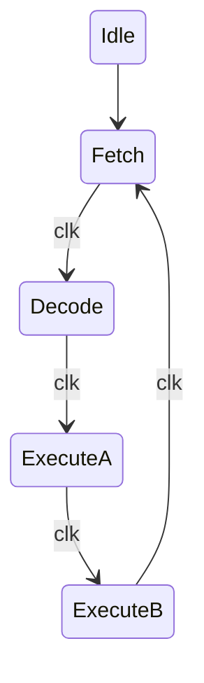

# Lab 8: Micro Processors  


Part 1: explanation of the uP  
contains the all the stuff from Martins lecture.  
 

Part 2: building the thing  
break down by module  
the Z conundrum and high impedence  
### Code for the ALU:
```verilog
`default_nettype none

module Arithmetic_Unit #
(
	parameter N = 4
)
(
	input EnableALU,
	input AddSub,
	input [N-1:0] A,
	input [N-1:0] B,
	output reg Carry,
	output reg [N-1:0] IB_ALU
);

always @(*) begin
	// if AddSub 1, sub,
	// A - B store send it out to the bus
	reg [N-1:0] ALUout = (AddSub == 1'b1) ? B - A : B + A;
	// TODO fix the trunkated carry out bit

	// we feed into the bus so we need high impedence
	assign IB_ALU = (EnableALU == 1'b1) ? ALUout : {N{1'bZ}};

end
endmodule
```  
### Logisim of the ALU:  
  
### Code for the Accumulator A:
```verilog
`default_nettype none

module Accumulator_A #
(
	parameter N = 4
)
(
	input MainClock,
	input ClearA,
	input LatchA,
	input EnableA,
	input [N-1:0] A,
	output [N-1:0] IB_BUS,
	output reg [N-1:0] AluA
);

	// Sequential Logic
	always @(posedge MainClock) begin
		if (ClearA)
			AluA <= {N{1'b0}};
		else begin
			if(LatchA)
				AluA <= A; //Load A into the ALU
		end
		
	
	end
	// Combinational Logic
	// this will bw the high impedence
	assign IB_BUS = (EnableA == 1'b1) ? AluA : {N{1'bZ}}; //

endmodule

`default_nettype wire
```  
### ROM:
Given the artifical constraint of the BUS being only 4 bits a system is needed to break down the 8 bits outputed by the program memory. We can break the 8 bit into two 4 bit with the first being instruction and the secon being data. The 6 operations this VSM uses are in the table below.
**ROM Table**
|Binary|Operation||
|---|---|---|
|0000|NOP|No Operation|
|0001|ADD|Adds the values of A and B|
|0010|SUB|Subtracts the values of A and B|
|0011|OUT|Out puts the value of A|
|0100|IN|Takes a given input of a User|
|0101|LDA|Loads a value into Accumulator A|  

The Control unit needs to be destructed further into two pieces a Micro Instruction module and an Instruction Register. Doing so will mandate the creation a finite state machine to cycle throough stages of Fetch (stage 1), Decode (stage 2), Execute A (stage 3), Execute B (stage 4). Cycling through each stage per clock cycle, see the diagram below.  

```LaTeX
\title{Proof 5}
\author{Colin McBride}
\date{October 2025}

\begin{document}

\maketitle


For every integer $x$, the remainder when $x^2$ is divided by $8$ is either $0$, $1$, or $4$.


Suppose $x$ is an integer. When we divide any integer by $8$, there are only $8$ possible remainders: $0, 1, 2, 3, 4, 5, 6,$ or $7$. This means every integer $x$ can be written as $x = 8k + r$, where $k$ is some integer and $r$ is one of these $8$ remainders. We will check what happens to $x^2$ in each case.

\textit{Case 1: $x$ is even.} If $x$ is even, we can write $x = 2m$ for some integer $m$. We need to consider whether $m$ is even or odd.

\quad \textit{Subcase 1a:} $m$ is even, so $m = 2n$ and thus $x = 4n$. Then 
$$x^2 = 16n^2 = 8(2n^2).$$
The remainder is $0$.

\quad \textit{Subcase 1b:} $m$ is odd, so $m = 2n+1$ and thus $x = 2(2n+1) = 4n+2$. Then 
$$x^2 = (4n+2)^2 = 16n^2 + 16n + 4 = 8(2n^2 + 2n) + 4.$$
The remainder is $4$.

\textit{Case 2: $x$ is odd.} If $x$ is odd, we can write $x = 2m + 1$ for some integer $m$. Then
$$x^2 = (2m+1)^2 = 4m^2 + 4m + 1 = 4m(m+1) + 1.$$
Notice that $m(m+1)$ is always even (since one of $m$ or $m+1$ must be even), so we can write $m(m+1) = 2\ell$ for some integer $\ell$. Therefore,
$$x^2 = 4(2\ell) + 1 = 8\ell + 1.$$
The remainder is $1$.

In all cases, the remainder when $x^2$ is divided by $8$ is either $0$, $1$, or $4$.


\end{document}

```
