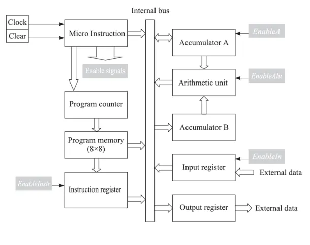
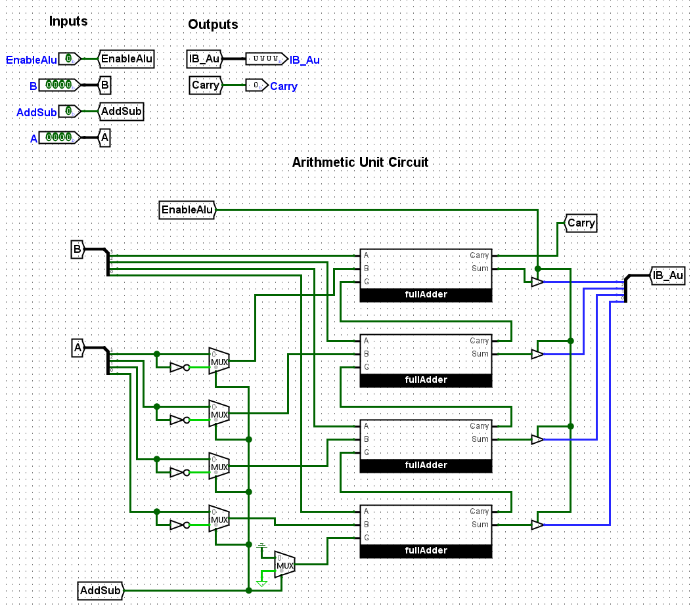

# Lab 8: Micro Processors  


Part 1: explanation of the uP  
contains the all the stuff from Martins lecture.  
 

Part 2: building the thing  
break down by module  
the Z conundrum and high impedence  
### Code for the ALU:
```verilog
`default_nettype none

module Arithmetic_Unit #
(
	parameter N = 4
)
(
	input EnableALU,
	input AddSub,
	input [N-1:0] A,
	input [N-1:0] B,
	output reg Carry,
	output reg [N-1:0] IB_ALU
);

always @(*) begin
	// if AddSub 1, sub,
	// A - B store send it out to the bus
	reg [N-1:0] ALUout = (AddSub == 1'b1) ? B - A : B + A;
	// TODO fix the trunkated carry out bit

	// we feed into the bus so we need high impedence
	assign IB_ALU = (EnableALU == 1'b1) ? ALUout : {N{1'bZ}};

end
endmodule
```  
### Logisim of the ALU:  
  
### Code for the Accumulator A:
```verilog
`default_nettype none

module Accumulator_A #
(
	parameter N = 4
)
(
	input MainClock,
	input ClearA,
	input LatchA,
	input EnableA,
	input [N-1:0] A,
	output [N-1:0] IB_BUS,
	output reg [N-1:0] AluA
);

	// Sequential Logic
	always @(posedge MainClock) begin
		if (ClearA)
			AluA <= {N{1'b0}};
		else begin
			if(LatchA)
				AluA <= A; //Load A into the ALU
		end
		
	
	end
	// Combinational Logic
	// this will bw the high impedence
	assign IB_BUS = (EnableA == 1'b1) ? AluA : {N{1'bZ}}; //

endmodule

`default_nettype wire
```  
### ROM:
Given the artifical constraint of the BUS being only 4 bits a system is needed to break down the 8 bits outputed by the program memory. We can break the 8 bit into two 4 bit with the first being instruction and the secon being data.
**ROM Table**
|Binary|Operation||
|---|---|---|
|0000|NOP|No Operation|
|0001|ADD|Adds the values of A and B|
|0010|SUB|Subtracts the values of A and B|
|0011|OUT|Out puts the value of A|
|0100|IN|Takes a given input of a User|
|0101|LDA|Loads a value into Accumulator A|
